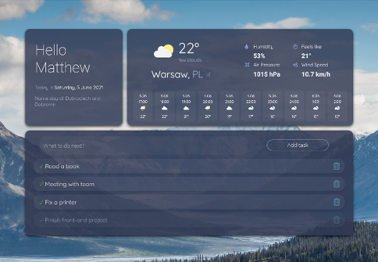

<h1>Hi there, I'm Matthew  </h2>
I'm 29 years old, passionate self-taught <strong>front-end developer</strong> from Poland. I graduated from dental school few years ago. Currently I'm working on learning to use React efficiently and expanding my UI design skills. I'm open to collaborate on interesting projects. 

## Favorite Tech
<table>
  <tr>
     <td align="center" width="96">
      
       HTML5
    </td>
       <td align="center" width="96">
      
       CSS3
    </td>
      <td align="center" width="96">
      
       Sass
    </td>
     <td align="center" width="96">
      
       Bootstrap
    </td>
     <td align="center" width="96">
      
       TypeScript
    </td>
    <td align="center" width="96">
      
       JavaScript
    </td>
    <td align="center" width="96">
      
       React
    </td>
   
  
  </tr>
  </table>
  
## Projects that might interest you

Daily Dashboard app

React project designed to be an alternative to default starting page in browser
 

<!--
**matt765/matt765** is a ✨ _special_ ✨ repository because its `README.md` (this file) appears on your GitHub profile.

Here are some ideas to get you started:

- 🔭 I’m currently working on ...
- 🌱 I’m currently learning ...
- 👯 I’m looking to collaborate on ...
- 🤔 I’m looking for help with ...
- 💬 Ask me about ...
- 📫 How to reach me: ...
- 😄 Pronouns: ...
- ⚡ Fun fact: ...
-->
