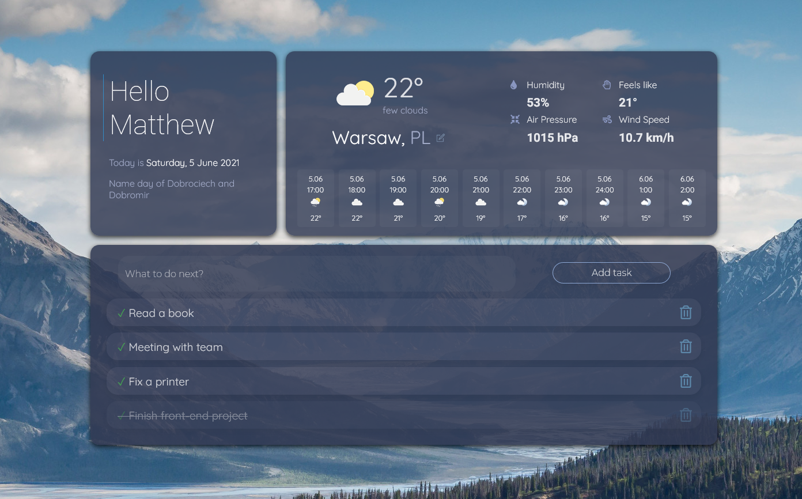

<h1>Hi there, I'm Matthew  </h2>
I'm 29 years old, passionate self-taught <strong>front-end developer</strong> from Poland.  Currently I'm working on learning to use React and Typescript efficiently and expanding  UI design skills. I'm open to collaborate on interesting projects. I graduated from dental school few years ago.   
Besides JS Playground, all public projects are available  live on<strong> GitHub Pages</strong>

## Favorite Tech
<table>
  <tr>
     <td align="center" width="96">
      
       HTML5
    </td>
       <td align="center" width="96">
      
       CSS3
    </td>
      <td align="center" width="96">
      
       Sass
    </td>
     <td align="center" width="96">
      
       Bootstrap
    </td>
    
    <td align="center" width="96">
      
       JavaScript
    </td>
    <td align="center" width="96">
      
       React
    </td>
   
  
  </tr>
  </table>
  
 

## Projects that might interest you 

<h4>ChatApp</h4>

Fully functional, responsive chat app, created in React. 

<a href="https://matt765.github.io/react-chat-app">Live link</a> | <a href="https://github.com/matt765/react-chat-app">Repository</a>

https://user-images.githubusercontent.com/63603595/126877482-82bf8d5d-4902-4228-8ab9-e617dbc26075.mp4

<h4>Daily Dashboard </h4>

React app designed to be an alternative to default starting page in browser

Live: https://matt765.github.io/react-daily-dashboard/

<h4>11 apps</h4>

Vanilla JS project with 11 fairly simple apps using external APIs, JS libraries and DOM manipulation.

Live here https://matt765.github.io/11-javascript-apps/

<h4>Complete websites</h4>

Fairytale Studio https://matt765.github.io/photography-website/

Dental Clinic https://matt765.github.io/dental-website/

Ray development https://matt765.github.io/real-estate-website/index.html

<!--
**matt765/matt765** is a ✨ _special_ ✨ repository because its `README.md` (this file) appears on your GitHub profile.

Here are some ideas to get you started:

- 🔭 I’m currently working on ...
- 🌱 I’m currently learning ...
- 👯 I’m looking to collaborate on ...
- 🤔 I’m looking for help with ...
- 💬 Ask me about ...
- 📫 How to reach me: ...
- 😄 Pronouns: ...
- ⚡ Fun fact: ...
-->
